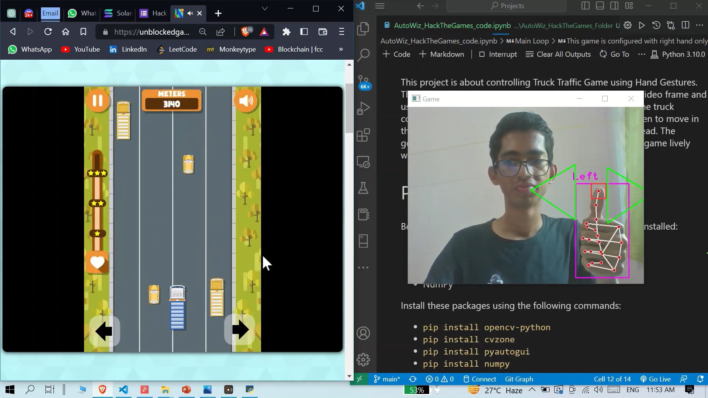

# Controlling Truck Traffic Game using Hand Gestures

This project is about controlling [Truck Traffic](https://unblockedgames.dev/truck-traffic/) Game using Hand Gestures.

## Table of Contents
* [General Info](#general-information)
* [Libraries Used](#libraries-used)
* [Screenshots](#screenshots)
* [Setup](#setup)
* [Project Status](#project-status)

## General Information
The game will detect the position of player's thumb in the video frame and use that information to control the direction of the truck.
The truck constantly moves in a straight direction. We got control when to move in the left lane or right lane depending upon the traffic up ahead.
The gesture controls make it smooth enough to experience the game lively with hand rather than keyboard.

## Libraries Used
- opencv-python - version 4.7.0.68
- cvzone - version 1.5.6
- PyAutoGUI - version 0.9.53
- numpy - version 1.24.2

## Screenshots

## Setup
Requirents for this project are the libraries listed above.  
To install these libraries to your local environment run the following installation commands in you terminal;
- `pip install opencv-python`
- `pip install cvzone`
- `pip install pyautogui`
- `pip install numpy`

## Project Status
Project is: _complete_  
